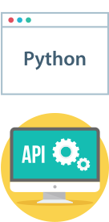

.. _api-doc:

.. toctree::
    :glob:

API Documentation
=================

{{cookiecutter.package_name}}
{{ '-' * (cookiecutter.package_name|length) }}

.. automodule:: {{cookiecutter.package_name}}
    :members:
    :undoc-members:
    :show-inheritance:

{{cookiecutter.package_name}}.app
{{ '-' * (cookiecutter.package_name|length) }}.app

.. automodule:: {{cookiecutter.package_name}}.app
  :members:
  :undoc-members:
  :show-inheritance:

{{cookiecutter.package_name}}.cli
{{ '-' * (cookiecutter.package_name|length) }}.cli

.. automodule:: {{cookiecutter.package_name}}.cli
  :members:
  :undoc-members:
  :show-inheritance:

{{cookiecutter.package_name}}.apis
{{ '-' * (cookiecutter.package_name|length) }}.apis

.. automodule:: {{cookiecutter.package_name}}.apis
  :members:
  :undoc-members:
  :show-inheritance:

{{cookiecutter.package_name}}.apis.info
{{ '-' * (cookiecutter.package_name|length) }}.apis.info

.. automodule:: {{cookiecutter.package_name}}.apis.info
  :members:
  :undoc-members:
  :show-inheritance:

{{cookiecutter.package_name}}.core
{{ '-' * (cookiecutter.package_name|length) }}.core

.. automodule:: {{cookiecutter.package_name}}.core
  :members:
  :undoc-members:
  :show-inheritance:

{{cookiecutter.package_name}}.core
{{ '-' * (cookiecutter.package_name|length) }}.core

.. automodule:: {{cookiecutter.package_name}}.core
  :members:
  :undoc-members:
  :show-inheritance:

{{cookiecutter.package_name}}.core.jsend
{{ '-' * (cookiecutter.package_name|length) }}.core.jsend

.. automodule:: {{cookiecutter.package_name}}.core.jsend
  :members:
  :undoc-members:
  :show-inheritance:

